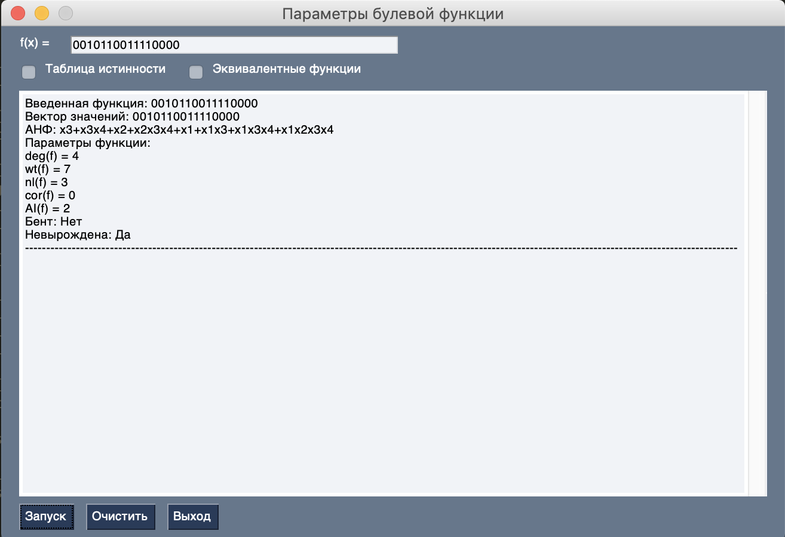
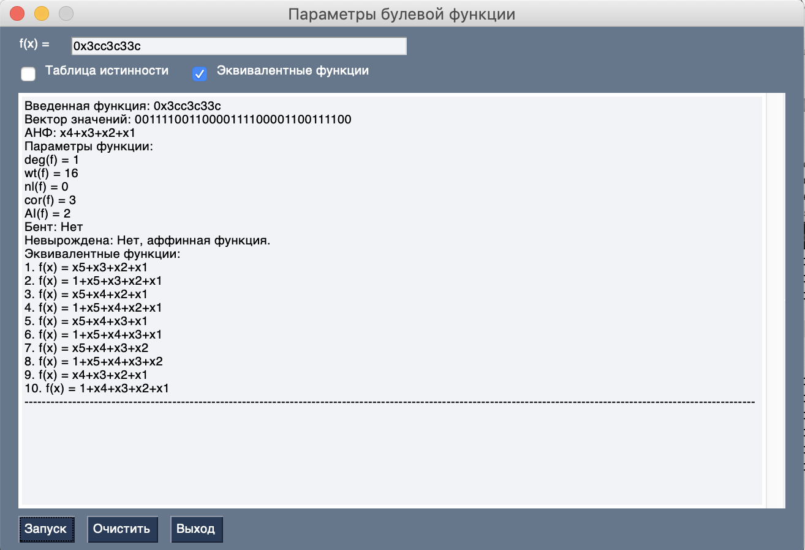
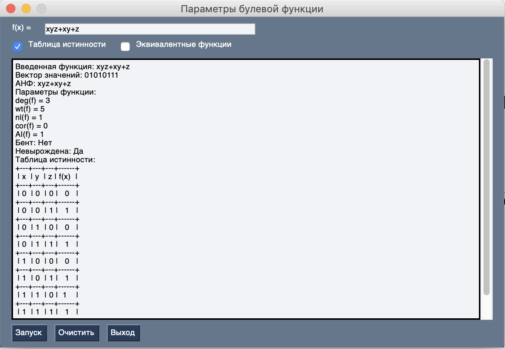

```
Данная программа вычисляет основные параметры булевой функции и проверяет ее на вырожденность.

Типы входных данных:
  1) Вектор значений. Пример: 01101001
  2) Вектор значений в шестнадцатеричном представлении. Пример: 0xf01a
  3) АНФ функции. Пример: x1x2+x1+x2

Вывод программы:
  1) Вектор значений функции
  2) АНФ функции
  3) Алгебраическая степень функции(обозначение deg(f))
  4) Вес функции(обозначение wt(f))
  5) Нелинейность функции(обозначение nl(f))
  6) Степень корреляционной иммунности функции(обозначение cor(f))
  7) Степень алгебраической иммунности функции(обозначение AI(f))
  8) Является ли функция бент-функцией
  9) Является ли функция невырожденной
  10) Таблица истинности функции, если выбрана соответствующая опция
  11) Эквивалентные функции(относительно группы Джевонса), если выбрана соответствующая опция

Основные функции, реализованные в программе:
  1) derivative(func, u) - вычисляет вектор значений производной функции func по направлению u
  2) non_degenerate(func) - проверяет является ли функция func невырожденной
  3) is_bent(func) - проверяет является ли функция func бент-функцией
  4) a_d(func,n) - вычисляет степень алгебраической иммунности функции func от n переменных по алгоритму из статьи Deepak Kumar Dalai и Subhamoy Maitra Algebraic Immunity of Boolean Functions – Analysis and Construction
  5) correlation_immunity(func) - вычисляет степень корреляционной иммунности функции func по ее спектральным коэффициентам
  6) W_H_transform(func, u) - вычисляет спектральный коэффициент функции func в точке u
  7) degree(pol) - вычисляет алгебаическую степень по АНФ pol функции
  8) jevons_eq(func, n) - выводит список всех эквивалентных(относительно группы Джевонса) функций функции func от n переменных
  9) tabl(polynom, func, n) - выводит таблицу истинности функции func от n переменных. Для построения таблицы используется модуль BeautifulTable
  10) to_vector(polynom) - по АНФ polynom вычисляет вектор значений функции 
  11) polynom(func) - возвращает АНФ функции func

Для создания графического интерфейса использовался модуль PySimpleGUI

Примеры работы:
```
  1) Введен двоичный вектор без дополнительных опций вывода
  
  2) Введен вектор значений в шестнадцатеричном представлении с опцией вывода эквивалентных функций
  
  3) Введена АНФ булевой функции с опцией вывода таблицы истинности
  
