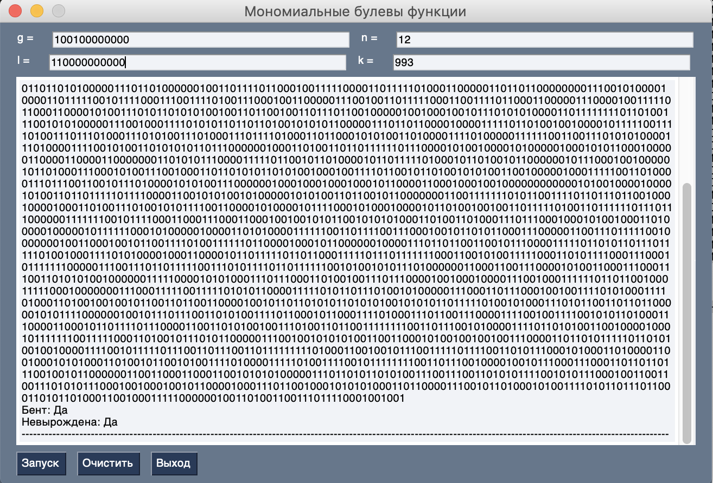

Данная программа вычисляет вектор значений мономиальной функции, проверяет ее на вырожденность и выводит является ли функция бент-функцией. На вход данная программа принимает g - неприводимый многочлен в виде двоичного вектора(например, при n = 5, g = 1+x+x^2+x^5 в виде двоичного вектора имеет вид 11100), по модулю которого ведутся вычисления в поле, n - степень расширения поля, число k и элемент l в виде двоичного вектора.

Для вычислений в поле была использована программа из https://github.com/Robert-Campbell-256/Number-Theory-Python

Для создания графического интерфейса использовался модуль PySimpleGU

Основные функции, реализованные в программе:
  1) trace(g,n,l,k) - вычисление вектора значений мономиальной функции tr(l*b^k)(g - неприводимый многочлен, n - степень расширения поля)
  2) derivative(func, u) - вычисляет вектор значений производной функции func по направлению u
  3) non_degenerate(func) - проверяет является ли функция func невырожденной
  4) is_bent(func) - проверяет является ли функция func бент-функцией
  5) W_H_transform(func, u) - вычисляет спектральный коэффициент функции func в точке u

Пример работы:
Результат работы программы при g=1+x^3, n=12, k=993, l=x+1

